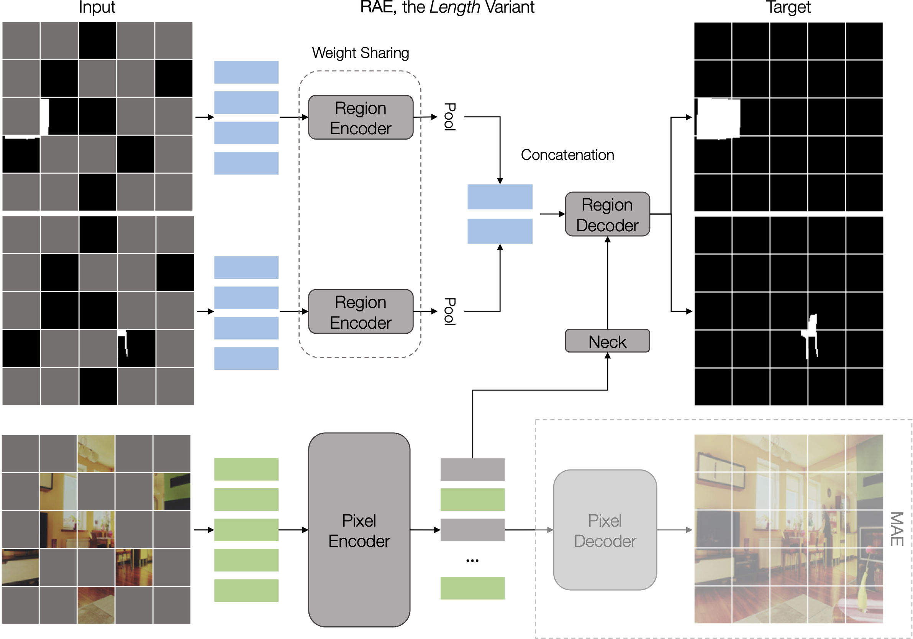

# R-MAE: Regions Meet Masked Autoencoders



This repository is an official implementation of [R-MAE: Regions Meet Masked Autoencoders](https://arxiv.org/abs/2306.05411) in PyTorch. It is based on the [BoxeR](https://github.com/kienduynguyen/BoxeR) repository, but adapted for self-supervised pre-training.

## Citing R-MAE
If you find R-MAE useful in your research, please consider citing:
```bibtex
@article{nguyen2023rmae,
  title={R-MAE: Regions Meet Masked Autoencoders},
  author={Duy{-}Kien Nguyen, Vaibhav Aggarwal, Yanghao Li, Martin R. Oswald, Alexander Kirillov, Cees G. M. Snoek, Xinlei Chen},
  journal={arXiv preprint arXiv:2306.05411},
  year={2023}
}
```

## Installation

### Requirements

* Linux, CUDA>=11, GCC>=5.4

* Python>=3.8

    We recommend you to use Anaconda to create a conda environment:
    ```bash
    conda create -n rmae python=3.8
    ```
    Then, activate the environment:
    ```bash
    conda activate rmae
    ```
  
* PyTorch>=1.10.1, torchvision>=0.11.2 (following instructions [here](https://pytorch.org/))

    For example, you could install pytorch and torchvision as following:
    ```bash
    pip install torch==1.10.1+cu113 torchvision==0.11.2+cu113 -f https://download.pytorch.org/whl/cu113/torch_stable.html
    ```
  
* Other requirements & Compilation
	If you are inside the repository, then run:
    ```bash
    python -m pip install -e ./
    ```

## Usage

### Dataset preparation

The datasets are assumed to exist in a directory specified by the environment variable $E2E_DATASETS.
If the environment variable is not specified, it will be set to be ```.data```.
Under this directory, our code will look for datasets in the structure described below.

```
$E2E_DATASETS/
├── coco/
└── imnet/
```

For pre-training on COCO, please download [COCO 2017 dataset](https://cocodataset.org/) and organize them as following:

```
$E2E_DATASETS/
└── coco/
	├── annotations/
		├── instances_train2017.json
		├── instances_val2017.json
		└── image_info_unlabeled2017.json
	└── image/
		├── train2017/
		├── fh_train2017/
		├── val2017/
		├── fh_val2017/
		├── unlabeled2017/
		└── fh_unlabeled2017/
```
You can generate FH masks for our pre-training by running ```create_fh_mask_for_coco.py``` in ```tools/preprocess```.

For pre-training on ImageNet, please download [ImageNet dataset](https://www.image-net.org/) and organize them as following:

```
$E2E_DATASETS/
└── imagenet/
	├── train/
	├── fh_train/
	├── val/
	└── fh_val/
```
You can generate FH masks for our pre-training by running ```create_fh_mask_for_imnet.py``` in ```tools/preprocess```.

### Training
Our script is able to automatically detect the number of available gpus on a single node.
It works best with Slurm system when it can auto-detect the number of available gpus along with nodes.
The command for pre-training R-MAE is simple as following:

```bash
python tools/run.py --config ${CONFIG_PATH} --model ${MODEL} --task ${TASK} --dataset ${DATASET}
```

For example,

* Pre-training on COCO

```bash
python tools/run.py --config pretrain/config/RMAE/COCO/rmae_fh_4000eps.yaml --model rmae --task pretrain --dataset coco
```

* Pre-training on ImageNet

```bash
python tools/run.py --config pretrain/config/RMAE/ImageNet/rmae_fh_800eps.yaml --model rmae --task pretrain --dataset imnet
```

#### Some tips to speed-up training
* If your file system is slow to read images but your memory is huge, you may consider enabling 'cache_mode' option to load whole dataset into memory at the beginning of training:

```bash
python tools/run.py --config ${CONFIG_PATH} --model ${MODEL} --task ${TASK} --dataset ${DATASET} dataset_config.${DATASET}_${TASK}.sampler=shard
```

* If your GPU memory does not fit the batch size, you may consider to use 'iter_per_update' to perform gradient accumulation:

```bash
python tools/run.py --config ${CONFIG_PATH} --model ${MODEL} --task ${TASK} --dataset ${DATASET} training.iter_per_update=2
```

* Our code also supports mixed precision training. It is recommended to use when you GPUs architecture can perform fast FP16 operations:

```bash
python tools/run.py --config ${CONFIG_PATH} --model ${MODEL} --task ${TASK} --dataset ${DATASET} training.use_fp16=(float16 or bfloat16)
```

## License

This project is under the CC-BY-NC 4.0 license. See [LICENSE](LICENSE) for details.